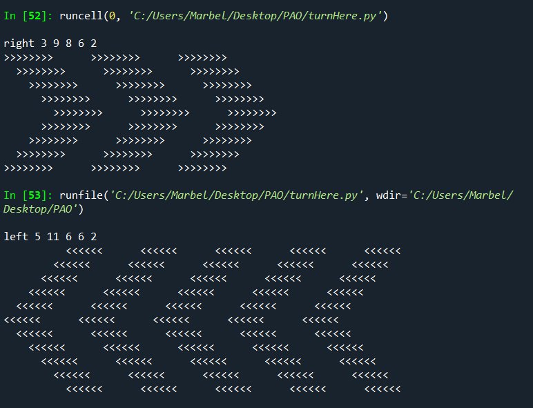

## Create 'Turn Here' Signs

Le Secrétaire aux Transports Pete vous a demandé de programmer des panneaux électroniques pour communiquer aux conducteurs qu'ils doivent tourner à gauche ou à droite.

Pete souhaite avoir de nombreuses options pour les panneaux, donc l'entrée est :
- direction -- qui est soit gauche (left) ou droite (right)
- howManyArrows (combien de flèches)
- heightOfArrows (hauteur des flèches)
- strokeThicknessOfArrows (épaisseur du trait des flèches)
- spacingBetweenArrows (espacement entre les flèches)
- additionalIndentOfEachLine (indentation supplémentaire pour chaque ligne) -- cela déterminera si la forme des flèches est subtile ou plus pointue

Cependant, Pete est aussi un minimaliste, donc toutes ces informations seront dans une seule chaîne de données.

Note :
- Les panneaux de virage à gauche seront composés de < et d'espaces uniquement.
- Les panneaux de virage à droite seront composés de > et d'espaces uniquement.


## Code
```python
import sys
import math


t = input()


#mise en place des parametres
direction = t.split()[0]
nArrows = int(t.split()[1])
height = int(t.split()[2])
thickness = int(t.split()[3])
spacing = int(t.split()[4])
pointy = int(t.split()[5])

#creation du pattern basic
if direction == 'right':
    pattern = thickness*'>'
else:
    pattern = thickness*'<'


#creation d'une ligne
ligne = ''
for _ in range(nArrows):
    ligne += pattern
    ligne += spacing*' '

#affichage des fleches
#gestion des espaces aux debuts de lignes pour definir la direction finale des fleches
# n represente le nombre max d'espaces qlq soit la ligne
n = (height//2) * 2
if direction == 'right':
    debutDeLigne = list(range(0, n + 1, 2)) + list(range(n - 2, -1, -2))
else:
    debutDeLigne = list(range(n, 0, -2)) + list(range(0, n + 1, 2))


for i in debutDeLigne:
    print(i*' '+ligne)
    
```

## Explication 

1. **Lecture de l'entrée :**
   - Le code lit une seule ligne d'entrée contenant des paramètres.

2. **Extraction des paramètres :**
   - Les valeurs nécessaires sont extraites à partir de la chaîne d'entrée, déterminant la direction, le nombre, la hauteur, l'épaisseur, l'espacement, et la pointe des flèches.

3. **Création du motif de base :**
   - Un motif de base est créé en répétant le caractère de flèche (`>` ou `<`) en fonction de l'épaisseur, selon la direction spécifiée.

4. **Création d'une ligne :**
   - Une ligne est formée en répétant le motif de base suivi d'un espace, pour le nombre total de flèches.

5. **Affichage des flèches :**
   - Le code détermine le nombre d'espaces au début de chaque ligne en fonction de la direction et de la hauteur. Ensuite, il imprime chaque ligne avec le bon nombre d'espaces au début.


## Resultat



