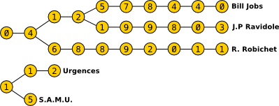

# Gestionnaire de Contacts pour Smartphone iDroid

En rejoignant l’équipe de développement du smartphone iDroid, vous avez été chargé de développer le gestionnaire de contacts. Cependant, des contraintes techniques strictes, comme une mémoire limitée et un processeur peu performant, ont été imposées.

## Points du Cahier des Charges

1. **Assistance intelligente à la saisie des numéros**
   - Afficher quasi instantanément le ou les numéros correspondant aux premiers chiffres saisis.

2. **Optimisation du stockage des numéros**
   - Éviter la duplication en mémoire des premiers chiffres communs aux numéros.

## Structure de Données (Fig 1)



## Mission

Écrire un programme qui affiche le nombre d'éléments (représentant des chiffres) nécessaires pour stocker une liste de numéros de téléphone conformément à la structure spécifiée.

### Entrées du Jeu

- **Entrée**
  - Ligne 1 : le nombre N de numéros de téléphone.
  - N lignes suivantes : Chaque ligne contient un numéro de téléphone de longueur maximale L. Les numéros sont composés uniquement des chiffres 0 à 9, sans espaces.

### Sortie

- Le nombre d'éléments (référençant un chiffre) stockés par la structure.

### Contraintes

- 0 ≤ N ≤ 10000
- 2 ≤ L ≤ 20
## Raisonnement
Le programme lit le nombre de numéros de téléphone et les stocke dans une liste appelée telephone.
Une fonction prefixe est définie pour calculer le préfixe commun entre deux numéros.
Le programme parcourt la liste des numéros pour calculer le nombre d'éléments nécessaires en évitant la duplication des préfixes communs.
Le résultat final est affiché.
## Code Python

```python
# -*- coding: utf-8 -*-
"""


@author: Marbel
"""

import sys
import math

# Auto-generated code below aims at helping you parse
# the standard input according to the problem statement.

n = int(input())
telephone = []

for i in range(n):
    telephone.append(input())

def prefixe(num1, num2):
    res = 0
    for i, j in zip(num1, num2):
        if i == j:
            res += 1
        else:
            break
    return res

# Le nombre d'éléments (référençant un chiffre) stockés dans la structure.
res = len(telephone[0])
for i in range(1, n):
    res += len(telephone[i]) - prefixe(telephone[i - 1], telephone[i])

print(res)
