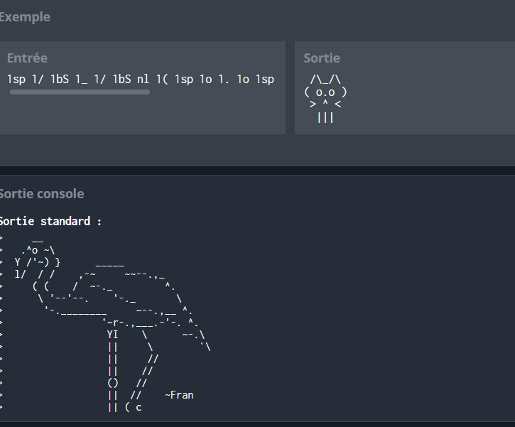

## Retro Typewriter Art


À l'époque, les gens s'amusaient à transformer des "recettes" en images surprises à l'aide de machines à écrire.

Utilisez la recette fournie pour créer une image reconnaissable.

Les morceaux dans la recette sont séparés par un espace. Chaque morceau vous dira soit nl signifiant Nouvelle Ligne (alias Retour chariot) ~ou~ combien de fois le caractère et quel caractère

Par exemple :
4z signifie zzzz
1{ signifie {
10= signifie ==========
5bS signifie \\\\\ (voir la liste des abréviations ci-dessous)
27 signifie 77
123 signifie 333333333333
(Si un morceau est composé uniquement de chiffres, le caractère est le dernier chiffre.)

Ainsi, si une partie de la recette est
2* 15sp 1x 4sQ nl
... cela vous dit d'afficher
**               x''''
et ensuite d'aller à la ligne suivante.


Abréviations utilisées :
sp = espace
bS = barre oblique inversée \
sQ = apostrophe simple '
et
nl = Nouvelle Ligne


Sources/références :
https://asciiart.cc
https://loriemerson.net/2013/01/18/d-i-y-typewriter-art/
https://www.youtube.com/watch?v=kyK5WvpFxqo
Entrée
chaine de caractères recette
Sortie
chaine de caractères (sur plusieurs lignes) pour montrer l'image que la recette crée
Contraintes
5 ≤ Longueur de la recette ≤ 1000
Il n'y aura pas de guillemets doubles (") dans la recette
La recette contiendra au moins 1 nl

## Exemple



## Code
```python
import sys
import math


#dictionnaire des chars speciaux
specialChars = {'sp':' ', 'bS': '\\' , 'sQ' :"'",'nl' : '\n' }


#fonction qui va interpreter chaque commande
def showCommand(command):
    #verifier si la commande contient des chars speciaux
    #les chars speciaux se composent de deux chars, on prends les deux derniers chars de la commande pour verifier
    if ''.join(command[-2:]) in specialChars:
        # erreur avec new line qui ne contient pas n nombre de print
        if command == 'nl':
            n = 1
        else:
            n = int(command[:-2])
            
        for _ in range(n):
            # end='' permet de ne pas retourner automatiquement une nouvelle ligne
            print(specialChars[''.join(command[-2:])], end='')
    else:
        #sinon c'est un seul char
        for _ in range(int(command[:-1])):
            print(command[-1:], end='')
t = input()

#diviser le texte en plusieurs commandes
for command in t.split():
    showCommand(command)


```

## Explication 

Le code prend une chaîne en entrée, la divise en plusieurs commandes, puis interprète chaque commande pour générer une sortie spécifique en utilisant un dictionnaire de caractères spéciaux. La fonction showCommand est responsable de l'interprétation de chaque commande. Les caractères spéciaux sont soit des caractères individuels, soit des séquences spéciales représentées dans le dictionnaire specialChars.


