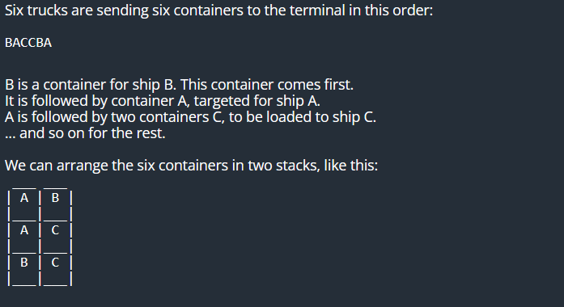
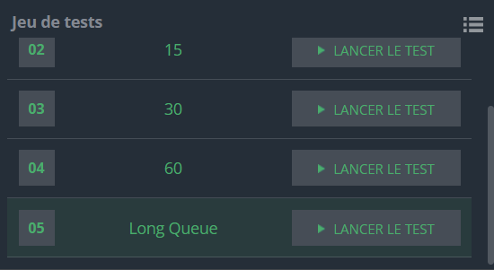

## Container Terminal


Les camions de marchandises transportent des conteneurs destinés à l'exportation vers un terminal portuaire.

Les conteneurs seront temporairement stockés dans le terminal en attendant l'arrivée des navires. Pour économiser de l'espace, les conteneurs sont généralement empilés dans le terminal.

Il existe différents navires en route vers différentes destinations. Les opérateurs du terminal doivent choisir les conteneurs corrects parmi le stock temporaire pour les charger sur les navires. Si les conteneurs appropriés se trouvent en haut de la pile, il sera facile de les prendre pour les charger. Mais si un conteneur souhaité est sous d'autres conteneurs, les conteneurs superposés doivent d'abord être déplacés avant d'atteindre le conteneur souhaité, entraînant des coûts d'exploitation supplémentaires et une perte de temps.

Pour gérer le terminal à conteneurs de la manière la plus efficace possible, vous avez besoin d'un plan.

Il y a des navires de A à Z, soit 26 navires différents en route vers 26 destinations différentes.

Vous connaissez l'horaire des navires. Le navire A arrivera plus tôt que le navire B. Le navire B arrivera plus tôt que le navire C. Les navires arrivent toujours par ordre alphabétique.

Vous connaissez également l'horaire des camions de marchandises. Les conteneurs pour différents navires arrivent dans un ordre prévisible. Aucun propriétaire de cargaison ne souhaite manquer un envoi. Toutes les cargaisons arriveront avant l'arrivée du premier navire.

Vous devez planifier quand les camions arrivent et comment les conteneurs doivent être stockés.

## Exemple


Entrée
5
A
CBACBACBACBACBACBA
CCCCCBBBBBAAAAA
BDNIDPD
CODINGAME
Sortie
1
3
1
4
4
## Code
```python
import sys
import math

# Fonction qui calcule la surface minimale
def trouverSurface(line):
    #creation de l'espace de travail
    stacks = []
    #on ajoute le premier conteneur
    stacks.append([line[0]])
    line = line[1:]
    
    for c in line:
        #on verifie si c est moins important que le dernier conteneur ajoute dans chaque emplacement de stockage
        dernierConteneurs = [sublist[-1] for sublist in stacks]
        if all(c > cont for cont in dernierConteneurs):
            #on ajoute un nouveau emplacement de stockage 
            stacks.append([c])
        else:
            position = next((i for i, char in enumerate(dernierConteneurs) if char >= c), None)
            #on ajout c au premier emplacement de stockage qui a la meme prioritee ou moins
            stacks[position].append(c)
    # le nombre d'emplacement est la taille de la liste stacks
    return len(stacks)
n = int(input())
for i in range(n):
    line = input()
    result = trouverSurface(line)
    print(result)    


```

## Explication 

1. **Fonction `trouverSurface` :**
   - `line`: La chaîne de caractères représentant l'ordre d'arrivée des conteneurs.

2. **Initialisation de l'espace de travail :**
   - `stacks = []`: Une liste qui représente les emplacements de stockage des conteneurs.

3. **Ajout du premier conteneur :**
   - `stacks.append([line[0]])`: Le premier conteneur est ajouté à un nouvel emplacement de stockage.

4. **Boucle principale pour le reste des conteneurs :**
   - `line = line[1:]`: La première lettre de la chaîne est retirée car le premier conteneur a déjà été pris en compte.
   - `for c in line:`: Boucle à travers chaque lettre de la chaîne restante.

5. **Vérification de la priorité du conteneur :**
   - `dernierConteneurs = [sublist[-1] for sublist in stacks]`: Liste des derniers conteneurs dans chaque emplacement de stockage.
   - `all(c > cont for cont in dernierConteneurs)`: Vérifie si le conteneur actuel a une priorité moins élevée que tous les derniers conteneurs dans les emplacements de stockage existants.

6. **Ajout d'un nouvel emplacement de stockage si nécessaire :**
   - Si le conteneur a une priorité moins élevée que tous les derniers conteneurs, un nouvel emplacement de stockage est créé avec ce conteneur.
   - Sinon, on recherche le premier emplacement de stockage où la priorité du dernier conteneur est égale ou inf à celle du conteneur actuel.

## TESTS




