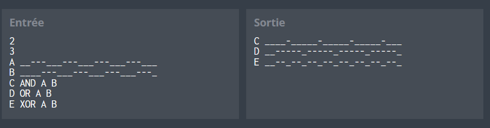
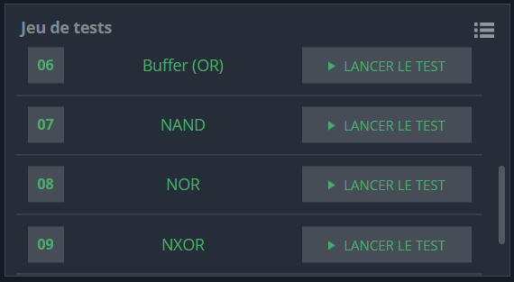

# Logic Gates
Un port logique est un dispositif électronique mettant en œuvre une fonction booléenne, effectuant une opération logique sur un ou plusieurs signaux binaires en entrée et produisant un seul signal binaire en sortie.

Étant donné n noms de signaux d'entrée et leurs données respectives, ainsi que m noms de signaux de sortie avec leur type de port correspondant et deux noms de signaux d'entrée, fournissez les noms des m signaux de sortie et leurs données respectives, dans le même ordre que celui fourni dans la description de l'entrée.

Tous les types de portes auront toujours deux entrées et une sortie.
Toutes les données des signaux d'entrée ont toujours la même longueur.

Les types de portes sont :

AND : effectue une opération logique ET.
OR : effectue une opération logique OU.
XOR : effectue une opération logique OU exclusif.
NAND : effectue une opération logique ET inversé.
NOR : effectue une opération logique OU inversé.
NXOR : effectue une opération logique OU exclusif inversé.
Les signaux sont représentés par des caractères de soulignement (_) et de tiret (-), un soulignement correspondant à un niveau bas (0, ou faux) et un tiret correspondant à un niveau haut (1, ou vrai).

# Exemple de Portes Logiques



## Code Python

```python
import sys
import math

# Auto-generated code below aims at helping you parse
# the standard input according to the problem statement.

n = int(input())
m = int(input())
iSignal = {}

for i in range(n):
    input_name, input_signal = input().split()
    iSignal[input_name] = input_signal

def decode(signal):
    return [char == "-" for char in signal]
    
def code(array):
    return ['-' if boolean_value else '_' for boolean_value in array]

def logical(s1, s2, opp):
    s1 = decode(s1)
    s2 = decode(s2)

    if opp == "AND":
        res = [a & b for a, b in zip(s1, s2)]
    elif opp == "OR":
        res = [a | b for a, b in zip(s1, s2)]
    elif opp == "XOR":
        res = [a != b for a, b in zip(s1, s2)]
    elif opp == "NAND":
        res = [not (a and b) for a, b in zip(s1, s2)]
    elif opp == "NOR":
        res = [not (a or b) for a, b in zip(s1, s2)]
    elif opp == "NXOR":
        res = [a == b for a, b in zip(s1, s2)]
    
    return ''.join(code(res))

for i in range(m):
    output_name, _type, input_name_1, input_name_2 = input().split()
    print(output_name + " " + str(logical(iSignal[input_name_1], iSignal[input_name_2], _type)))
```
## Tests

## Explication du code
Les fonctions decode, code, et logical sont utilisées pour décoder les signaux, coder les résultats et effectuer les opérations logiques, respectivement.

Tests du Code
