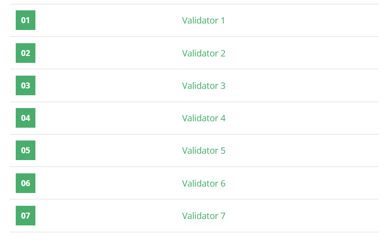

## Problème

Vous êtes propriétaire d'un petit magasin avec **c** articles de vêtements en inventaire, et **p** clients entrent dans le magasin au cours de la semaine. Chaque article a une **catégorie**, une **taille**, et un **prix** unique. Chaque article ne peut être vendu qu'une seule fois.

Chaque client demande un article d'une certaine **catégorie** et **taille** et choisit l'option la moins chère si plusieurs articles sont disponibles. Chaque client passe une seule commande.

### Entrée
1. Un entier **c** représentant le nombre d'articles en stock.
2. Un entier **p** représentant le nombre de clients.
3. Les **c** lignes suivantes contiennent la description d'un article sous la forme : `CATÉGORIE TAILLE PRIX`.
4. Les **p** lignes suivantes contiennent la commande de chaque client sous la forme : `CATÉGORIE TAILLE`.

### Sortie
Pour chaque client, afficher le **prix** de l'article vendu ou **NONE** si aucun article correspondant n'est trouvé.

### Contraintes
- **p > 0**

## Exemple d'Exécution

**Entrée**
```
3
2
JEANS LARGE 30
SHIRT SMALL 15
JACKET LARGE 20
JEANS LARGE
JACKET LARGE
```

**Sortie**
```
30
20
```

## Code Python

```python
import sys

# Lecture des entrées
c = int(input().strip())
p = int(input().strip())

# Dictionnaire pour stocker les articles disponibles
inventory = {}

# Chargement des articles dans l'inventaire
for _ in range(c):
    # Lecture de chaque article
    category, size, price = input().strip().split()
    price = int(price)
    
    # Clé sous la forme (catégorie, taille)
    key = (category, size)
    
    # Ajout de l'article s'il est moins cher
    if key in inventory:
        inventory[key].append(price)
    else:
        inventory[key] = [price]

# Tri des prix de chaque catégorie/taille pour accéder au moins cher
for key in inventory:
    inventory[key].sort()

# Traitement des commandes
for _ in range(p):
    # Lecture de chaque commande
    category, size = input().strip().split()
    key = (category, size)
    
    # Vérification de la disponibilité de l'article
    if key in inventory and inventory[key]:
        # Obtenir le prix le plus bas
        cheapest_price = inventory[key].pop(0)
        print(cheapest_price)
    else:
        print("NONE")
```

## Explication du Code

1. **Lecture des Données** :
   - Les valeurs **c** et **p** sont lues pour déterminer le nombre d'articles et de commandes.
   - Les articles sont chargés dans un dictionnaire nommé `inventory`, où chaque clé est un tuple `(catégorie, taille)` et la valeur est une liste des prix pour cette combinaison.

2. **Gestion de l'Inventaire** :
   - Pour chaque article, si une combinaison catégorie/taille existe déjà dans le dictionnaire, le prix est ajouté à la liste de cette clé.
   - Chaque liste de prix est ensuite triée pour que l'accès au prix le plus bas soit optimisé.

3. **Traitement des Commandes** :
   - Pour chaque commande, la clé `(catégorie, taille)` est recherchée dans `inventory`.
   - Si une liste de prix existe et qu'elle n'est pas vide, le premier élément (le moins cher) est récupéré et supprimé.
   - Si aucun article correspondant n'est trouvé, "NONE" est imprimé.

## Tests
