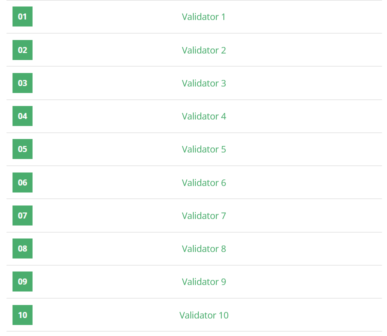

## Problème

L’objectif est de trouver toutes les façons d'écrire un mot donné en utilisant uniquement les symboles chimiques du tableau périodique. Chaque élément a un symbole d'une ou deux lettres, comme "H" pour l'hydrogène, "Be" pour le béryllium, "Cr" pour le chrome, etc. Le programme doit être capable de détecter les combinaisons possibles pour construire le mot en utilisant ces symboles.

Par exemple, pour le mot **"Pauses"**, les combinaisons possibles pourraient inclure :
- **PAuSEs** (P Au S Es)
- **PAuSeS** (P Au Se S)
- **PaUSEs** (Pa U S Es)
- **PaUSeS** (Pa U Se S)

## Exemple d'exécution

**Entrée :**
```
Carbon
```

**Sortie :**
```
CArBON
CaRbON
```

## Code Python

```python
# Entrée de l'utilisateur
word = input().lower()

# Dictionnaire des éléments chimiques avec les clés en minuscules et les valeurs en majuscules
elements_dict = {
    "h": "H", "he": "He", "li": "Li", "be": "Be", "b": "B", "c": "C", "n": "N", "o": "O", "f": "F", "ne": "Ne",
    "na": "Na", "mg": "Mg", "al": "Al", "si": "Si", "p": "P", "s": "S", "cl": "Cl", "ar": "Ar", "k": "K", "ca": "Ca",
    "sc": "Sc", "ti": "Ti", "v": "V", "cr": "Cr", "mn": "Mn", "fe": "Fe", "co": "Co", "ni": "Ni", "cu": "Cu", "zn": "Zn",
    "ga": "Ga", "ge": "Ge", "as": "As", "se": "Se", "br": "Br", "kr": "Kr", "rb": "Rb", "sr": "Sr", "y": "Y", "zr": "Zr",
    "nb": "Nb", "mo": "Mo", "tc": "Tc", "ru": "Ru", "rh": "Rh", "pd": "Pd", "ag": "Ag", "cd": "Cd", "in": "In", "sn": "Sn",
    "sb": "Sb", "te": "Te", "i": "I", "xe": "Xe", "cs": "Cs", "ba": "Ba", "la": "La", "ce": "Ce", "pr": "Pr", "nd": "Nd",
    "pm": "Pm", "sm": "Sm", "eu": "Eu", "gd": "Gd", "tb": "Tb", "dy": "Dy", "ho": "Ho", "er": "Er", "tm": "Tm", "yb": "Yb",
    "lu": "Lu", "hf": "Hf", "ta": "Ta", "w": "W", "re": "Re", "os": "Os", "ir": "Ir", "pt": "Pt", "au": "Au", "hg": "Hg",
    "tl": "Tl", "pb": "Pb", "bi": "Bi", "po": "Po", "at": "At", "rn": "Rn", "fr": "Fr", "ra": "Ra", "ac": "Ac", "th": "Th",
    "pa": "Pa", "u": "U", "np": "Np", "pu": "Pu", "am": "Am", "cm": "Cm", "bk": "Bk", "cf": "Cf", "es": "Es", "fm": "Fm",
    "md": "Md", "no": "No", "lr": "Lr", "rf": "Rf", "db": "Db", "sg": "Sg", "bh": "Bh", "hs": "Hs", "mt": "Mt", "ds": "Ds",
    "rg": "Rg", "cn": "Cn", "nh": "Nh", "fl": "Fl", "mc": "Mc", "lv": "Lv", "ts": "Ts", "og": "Og"
}

# Fonction de recherche de combinaisons pour former le mot
def find_combinations(remaining, current_combination, results):
    # Condition de fin : si le mot est construit
    if not remaining:
        results.append(current_combination)
        return
    
    # Vérifier les combinaisons d'un ou deux caractères
    for i in range(1, 3):
        # Vérification pour ne pas dépasser la longueur
        if i <= len(remaining):
            prefix = remaining[:i]
            if prefix in elements_dict:
                # Ajout de l'élément correspondant et appel récursif
                find_combinations(remaining[i:], current_combination + elements_dict[prefix], results)

# Liste des résultats pour stocker les combinaisons valides
results = []
find_combinations(word, "", results)

# Affichage des résultats en ordre lexicographique, ou "none" si aucun résultat
if results:
    results.sort()
    for combination in results:
        print(combination)
else:
    print("none")
```

## Explication du Code

1. **Initialisation des Données** : Le dictionnaire `elements_dict` contient les symboles des éléments chimiques. L'utilisateur entre le mot souhaité, qui est transformé en minuscules pour faciliter la recherche.

2. **Fonction `find_combinations`** :
   - La fonction prend le mot restant (`remaining`), la combinaison courante (`current_combination`), et la liste des résultats (`results`).
   - Si le mot restant est vide, cela signifie que la combinaison est valide et elle est ajoutée aux résultats.
   - La fonction teste les symboles de longueur 1 et 2 pour voir si une partie du mot peut correspondre à un élément chimique. Si oui, elle ajoute cet élément à la combinaison courante et appelle la fonction de manière récursive avec le reste du mot.

3. **Affichage** : Une fois toutes les combinaisons possibles trouvées, elles sont triées dans l’ordre lexicographique. Si aucune combinaison n’est trouvée, "none" est affiché.

## Tests


