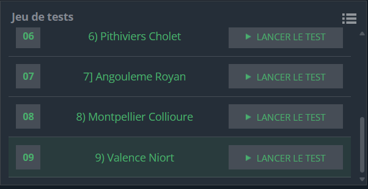

## Problème

Vous devez déterminer si vous devriez prendre la voiture ou le train pour effectuer un trajet entre deux villes, en fonction du temps nécessaire. Chaque moyen de transport possède des vitesses moyennes et des contraintes spécifiques. Vous devez calculer le temps total pour chaque option et choisir celle qui est la plus rapide.

### Contraintes des moyens de transport :

#### Train :
1. Vitesse moyenne hors ville : 284 km/h.
2. Vitesse moyenne dans une ville : 50 km/h (±3 km autour des villes).
3. Arrêt à chaque gare : 8 minutes.
4. Temps de trajet pour atteindre la première gare : 35 minutes.
5. Temps pour atteindre la destination finale depuis la dernière gare : 30 minutes.

#### Voiture :
1. Vitesse moyenne hors ville : 105 km/h.
2. Vitesse moyenne dans une ville : 50 km/h (±7 km autour des villes).

### Entrée
1. La première ligne indique la ville de départ et la ville d'arrivée.
2. La deuxième ligne contient un entier \( N \), le nombre de routes.
3. Les \( N \) lignes suivantes décrivent chaque segment de route avec les informations : ville1, ville2, distance.

### Sortie
Imprimez `CAR` ou `TRAIN` suivi de la durée en heures et minutes (`h:mm`), indiquant le moyen de transport le plus rapide.

---

## Exemple d'exécution

### Exemple 1

#### Entrée
```
Paris Tours
2
Paris Orleans 133
Orleans Tours 218
```

#### Sortie
```
TRAIN 2:39
```

---

## Code Python

```python
import math

def calculate_train_time(distances):
    # temps fixe depuis depart vers la gare
    time = 35 + 30
    for i, d in enumerate(distances):
        if d <= 6:
            # Si toute la distance est dans la ville
            time += d * 60 / 50
        else:
            if i == 0:  # si depart
                time += 3 * 60 / 50  # 3 km à 50 km/h au départ
                time += (d - 6) * 60 / 284  #intermediaire
                time += 3 * 60 / 50  # 3 km à 50 km/h avant la gare suivante
            else:  # Portion intermédiaire
                time += 3 * 60 / 50  # 3 km à 50 km/h avant la gare 
                time += (d - 6) * 60 / 284  # Distance intermédiaire
                time += 3 * 60 / 50  # 3 km à 50 km/h avant la gare suivante
        if i != len(distances) - 1:  # Pas d'arrêt pour la dernière gare
            time += 8  # arret gare
    return math.floor(time)

def calculate_car_time(distances):
    time = 0
    for d in distances:
        # 7 km à 50 km/h au départ
        if d > 14:
            time += 7 * 60 / 50
            # Distance restante à 105 km/h
            time += (d - 14) * 60 / 105
            # 7 km à 50 km/h à l'arrivee
            time += 7 * 60 / 50
        else:
            # Toute la distance est a 50 km/h
            time += d * 60 / 50
    return math.floor(time)

start_end = input().split()
start_city, end_city = start_end[0], start_end[1]
n = int(input())

# Construire une liste de segments de distance
segments = {}
for _ in range(n):
    city1, city2, dist = input().split()
    dist = float(dist) 
    segments[city1, city2] = dist

# Trouver les distances pour le trajet
distances = []
current_city = start_city
while current_city != end_city:
    for (c1, c2), d in segments.items():
        if c1 == current_city:
            distances.append(d)
            current_city = c2
            break


train_time = calculate_train_time(distances)
car_time = calculate_car_time(distances)


if train_time <= car_time:
    hours = train_time // 60
    minutes = train_time % 60
    print(f"TRAIN {hours}:{minutes:02d}")
else:
    hours = car_time // 60
    minutes = car_time % 60
    print(f"CAR {hours}:{minutes:02d}")

```

---

## Explication du Code

1. **Lecture des données** :
   - Les données d'entrée sont lues pour extraire les distances entre les villes dans l'ordre du trajet.

2. **Calcul des temps** :
   - **Temps en train** :
     - Les 3 km autour des villes sont calculés à 50 km/h.
     - La distance restante est calculée à 284 km/h.
     - Les arrêts ajoutent 8 minutes.
     - Les temps fixes pour rejoindre la gare et la destination finale sont inclus.
   - **Temps en voiture** :
     - Les 7 km autour des villes sont calculés à 50 km/h.
     - La distance restante est calculée à 105 km/h.

3. **Comparaison des temps** :
   - Les temps sont comparés, et le résultat est formaté en `h:mm`.

---

## Tests

