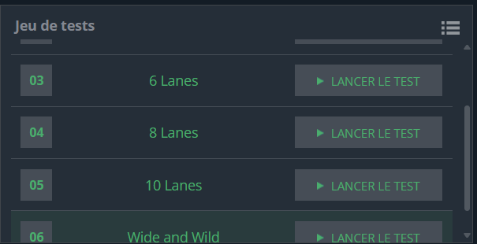

## Problème

Ghost Legs est un jeu où l'on suit des lignes verticales et horizontales pour déterminer une correspondance entre des étiquettes situées en haut (T) et en bas (B) d'un diagramme.  

À chaque connexion horizontale rencontrée, le chemin doit suivre cette connexion à gauche ou à droite, avant de continuer vers le bas. Chaque étiquette en haut correspond à une seule étiquette en bas.  

Le but est de déterminer la correspondance entre chaque étiquette du haut et celles du bas, dans l'ordre des étiquettes du haut de gauche à droite.

### Entrée
- `W` et `H` : la largeur et la hauteur du diagramme.
- `H` lignes contenant le diagramme (étiquettes en haut, lignes verticales et horizontales, et étiquettes en bas).

### Sortie
- Une liste des correspondances entre les étiquettes du haut et celles du bas, chaque correspondance sur une nouvelle ligne, dans l'ordre des étiquettes du haut.

## Exemple d'exécution

### Entrée
```
7 7
A  B  C
|  |  |
|--|  |
|  |--|
|  |--|
|  |  |
1  2  3
```

### Sortie
```
A2
B1
C3
```

## Code Python

```python
import sys


w, h = [int(i) for i in input().split()]
diagram = [input() for _ in range(h)]

top_labels = diagram[0][::3]
bottom_labels = diagram[-1][::3]

def follow_path(start_col):
    row, col = 1, start_col
    while row < h - 1:  # Parcourir jusqu'à la dernière ligne avant les étiquettes du bas
        if col > 0 and diagram[row][col - 1] == '-':  # Aller à gauche si un connecteur existe
            col -= 3
        elif col < w - 1 and diagram[row][col + 1] == '-':  # Aller à droite si un connecteur existe
            col += 3
        row += 1
    return col // 3  

result = []
for i, label in enumerate(top_labels):
    final_col = follow_path(i * 3)
    result.append(f"{label}{bottom_labels[final_col]}")


print("\n".join(result))
```

## Explication du Code

1. **Lecture et Préparation** :  
   - Les étiquettes du haut (`top_labels`) et du bas (`bottom_labels`) sont extraites en prenant un caractère tous les 3 (colonnes séparées par des espaces).
   - Les dimensions du diagramme et le contenu des lignes sont lus.

2. **Fonction `follow_path`** :  
   - Cette fonction simule le chemin d'une ligne en partant d'une colonne donnée.
   - Elle parcourt le diagramme ligne par ligne :
     - Si une connexion horizontale `'-'` est trouvée à gauche ou à droite, elle ajuste la colonne.
     - Elle continue vers le bas jusqu'à atteindre la dernière ligne.

3. **Association des étiquettes** :  
   - Pour chaque étiquette en haut, on suit son chemin jusqu'en bas avec la fonction `follow_path`.
   - Le résultat est une correspondance entre une étiquette du haut et une étiquette du bas.


## Tests
