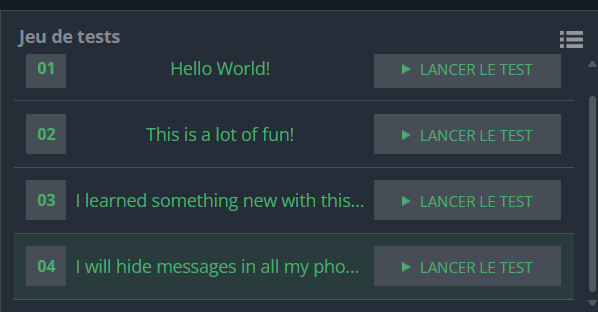

## Problème

La **stéganographie** dans les images consiste à cacher des informations dans les pixels, de manière imperceptible à l'œil humain. Dans ce problème, des messages ASCII sont dissimulés dans les pixels d'une image. Plus précisément, chaque pixel contient un seul bit du message caché : son bit le moins significatif (**LSB**).

L'objectif est d'extraire ce message en procédant comme suit :

1. Lire les **dimensions de l'image** et les **valeurs des pixels**.
2. Extraire le **bit le moins significatif** (LSB) de chaque pixel.
3. Regrouper les bits extraits en groupes de 8 bits pour former des octets.
4. Convertir chaque octet en son équivalent ASCII.
5. Construire et afficher le message final.

### Entrée

- **Ligne 1** : Deux entiers `w` et `h`, représentant la largeur et la hauteur de l'image.
- **Lignes suivantes** : `h` lignes contenant `w` entiers séparés par des espaces, représentant les valeurs des pixels.

### Sortie

- Une seule ligne : le message ASCII extrait.

### Contraintes

- \( 8 \leq w, h \leq 50 \)
- Le nombre total de pixels (\( w \times h \)) est toujours un multiple de 8, garantissant que chaque octet peut être correctement formé.

---

### Exemple

#### Entrée

```
4 4
106 19 134 22
161 192 98 184
52 51 97 88
208 63 58 25
```

#### Sortie

```
He
```

**Explications :**

1. Extraction des bits LSB :
   ```
   0 1 0 0 1 0 0 0  # Ligne 1
   1 0 0 0 0 0 0 0  # Ligne 2
   0 1 1 0 0 0 0 1  # Ligne 3
   0 1 0 0 0 0 1 1  # Ligne 4
   ```

2. Assemblage en octets :  
   - Bits : `01001000` → Octet : 72 (H)  
   - Bits : `01100101` → Octet : 101 (e)

3. Résultat ASCII : **"He"**.

---

## Code Python

```python
import sys


w, h = [int(i) for i in input().split()]
bits = []
for _ in range(h):
    row = list(map(int, input().split()))
    for pixel in row:
        # Extraire le bit le moins significatif (LSB) de chaque pixel
        bits.append(pixel & 1)

# regrouper les bits en octets (groupes de 8 bits)
bytes_list = ["".join(map(str, bits[i:i+8])) for i in range(0, len(bits), 8)]

# convertir chaque octet binaire en  ASCII
ascii_message = "".join([chr(int(byte, 2)) for byte in bytes_list])

print(ascii_message)

```

---

## Explication du Code

1. **Lecture des dimensions** :
   - On commence par lire la largeur (`w`) et la hauteur (`h`) de l'image.

2. **Extraction des LSB** :
   - On parcourt chaque pixel et extrait son bit le moins significatif (LSB) à l'aide de l'opération binaire `pixel & 1`.
   - Les bits sont stockés dans une liste appelée `bits`.

3. **Regroupement des bits en octets** :
   - Les bits extraits sont regroupés en séquences de 8 bits, chaque séquence représentant un caractère ASCII.

4. **Conversion en ASCII** :
   - Chaque groupe de 8 bits est converti en un entier (`int(byte, 2)`), qui est ensuite transformé en un caractère ASCII (`chr`).

5. **Affichage du message** :
   - Tous les caractères sont assemblés pour former le message caché et sont affichés.

---

## Exemple d'Exécution

### Entrée
```
8 12
220 251 30 182 233 122 150 30
132 101 135 212 246 201 128 203
62 33 39 70 73 175 218 140
44 165 9 140 83 67 34 100
142 75 125 242 49 175 209 37
252 26 123 6 186 72 230 94
218 85 228 205 146 67 219 187
194 159 81 190 51 235 41 121
208 33 245 71 172 218 97 130
122 31 135 198 135 249 174 28
162 109 149 216 156 195 140 10
100 252 1 164 150 22 144 109
```

### Sortie
```
Hello World!
```

---

## Tests

### Test 1
#### Entrée
```
4 4
106 19 134 22
161 192 98 184
52 51 97 88
208 63 58 25
```
#### Sortie
```
He
```

### Test 2
#### Entrée
```
8 2
200 201 202 203 204 205 206 207
208 209 210 211 212 213 214 215
```
#### Sortie
```
@@
```

