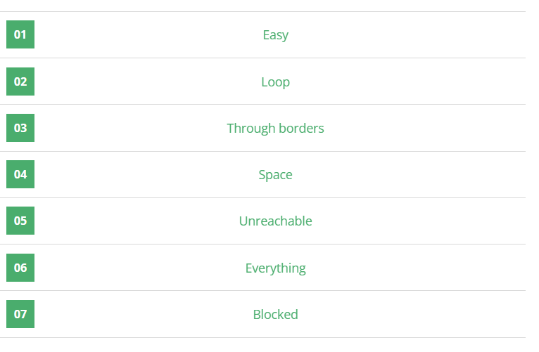

## Problème

Vous êtes dans un labyrinthe périodique. Vous devez calculer le nombre minimal de déplacements nécessaires pour atteindre chaque cellule à partir d’un point de départ. La sortie doit contenir :
- Les murs (`#`) tels quels.
- Les points inaccessibles (`.`).
- Les distances en caractères de `0` à `9`, puis de `A` à `Z` pour représenter les distances en base 36 (0-35).

Les mouvements autorisés sont :
- Haut, bas, gauche et droite.
- Si vous sortez à gauche, vous réapparaissez à droite, et vice versa. De même pour haut et bas.

Les contraintes sont les suivantes :
- Le labyrinthe est de dimensions 3 ≤ w, h ≤ 30.
- Les déplacements nécessaires pour atteindre une cellule ne dépasseront jamais 35.

## Exemple d'exécution

### Entrée
```
10 5
##########
#S.......#
##.#####.#
##.#.....#
##########
```

### Sortie
```
##########
#01234567#
##2#####8#
##3#DCBA9#
##########
```

---

## Code Python

```python
import sys
from collections import deque

w, h = [int(i) for i in input().split()]


maze = [list(input().strip()) for _ in range(h)]

def distance_to_char(d):
    if d < 10:
        return str(d)
    return chr(ord('A') + d - 10)

start = None
for y in range(h):
    for x in range(w):
        if maze[y][x] == 'S':
            start = (x, y)
            break
    if start:
        break

directions = [(-1, 0), (1, 0), (0, -1), (0, 1)]

# BFS pour calculer les distances
def bfs(start):
    queue = deque([(start[0], start[1], 0)])  # (x, y, distance)
    visited = set()
    visited.add(start)

    while queue:
        x, y, dist = queue.popleft()
        maze[y][x] = distance_to_char(dist)

        for dx, dy in directions:
            nx, ny = (x + dx) % w, (y + dy) % h  #deplacements periodiques
            if (nx, ny) not in visited and maze[ny][nx] == '.':
                visited.add((nx, ny))
                queue.append((nx, ny, dist + 1))


if start:
    bfs(start)

for y in range(h):
    for x in range(w):
        if maze[y][x] == '.':
            maze[y][x] = '.'


for row in maze:
    print(''.join(row))
```

---

## Explication du Code

1. **Entrée et initialisation** :
   - Lecture des dimensions et du labyrinthe en tant que liste de listes.
   - Recherche de la position de départ `S`.

2. **Fonction `distance_to_char`** :
   - Convertit les distances en caractères (`0-9`, `A-Z`).

3. **Mouvements périodiques** :
   - Lors des déplacements, les indices sont calculés en utilisant les modulo sur `w` et `h` pour gérer les frontières du labyrinthe.

4. **Algorithme BFS** :
   - Utilise une file (deque) pour explorer les cellules adjacentes dans un ordre croissant de distance.
   - Met à jour le labyrinthe avec les distances.

5. **Traitement final** :
   - Les points inaccessibles (`.`) et les murs (`#`) restent inchangés.

6. **Sortie** :
   - Chaque ligne est reconstruite et affichée.

---

## Tests

### Exemple 1
#### Entrée
```
10 5
##########
#S.......#
##.#####.#
##.#.....#
##########
```
#### Sortie
```
##########
#01234567#
##2#####8#
##3#DCBA9#
##########
```

### Exemple 2
#### Entrée
```
5 3
#####
#S..#
#####
```
#### Sortie
```
#####
#012#
#####
```

---

