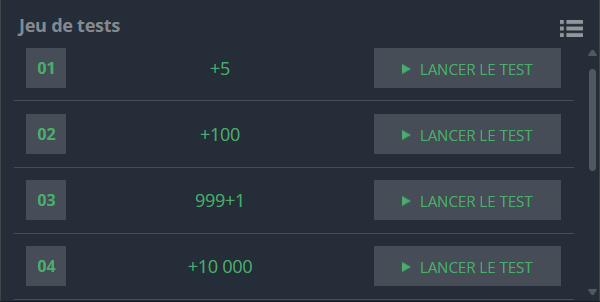

## Problème

Les plaques d'immatriculation françaises ont le format suivant : **ab-cde-fg**, où :
- `ab` et `fg` sont des combinaisons de deux lettres (de `AA` à `ZZ`).
- `cde` est un nombre allant de `001` à `999`.

Les plaques sont générées dans un ordre lexicographique et numérique strict. Par exemple :
```
AA-001-AA, AA-002-AA, ..., AA-999-AA
AA-001-AB, ..., AA-999-ZZ
AB-001-AA, ..., ZZ-999-ZZ
```

### Objectif
Étant donné une plaque de départ `x` et un nombre `n` représentant le nombre de voitures immatriculées après cette plaque, déterminez la plaque d'immatriculation finale.

### Contraintes
- `1 ≤ n ≤ 100 000 000`.

---

## Exemple d'exécution

### Entrée
```
AB-123-CD
5
```

### Sortie
```
AB-128-CD
```

---

## Code Python

```python
def increment_plate(plate, n):
    # Extraire les parties de la plaque
    prefix, number, suffix = plate.split('-')
    number = int(number)
    
    # convertir le nombre en une forme incrémentee
    
    number += n
    nb_overflow = number % 999
    carry = number // 1000
    number %= 999

    suffix = list(suffix)
    while carry > 0:
        carry, suffix[1] = divmod(ord(suffix[1]) - 65 + carry, 26)
        suffix[1] = chr(suffix[1] + 65)
        carry, suffix[0] = divmod(ord(suffix[0]) - 65 + carry, 26)
        suffix[0] = chr(suffix[0] + 65)


    prefix = list(prefix)
    while carry > 0:
        carry, prefix[1] = divmod(ord(prefix[1]) - 65 + carry, 26)
        prefix[1] = chr(prefix[1] + 65)
        carry, prefix[0] = divmod(ord(prefix[0]) - 65 + carry, 26)
        prefix[0] = chr(prefix[0] + 65)

    # Formater le résultat
    result = f"{''.join(prefix)}-{number:03}-{''.join(suffix)}"
    return result


x = input()
n = int(input())


y = increment_plate(x, n)

print(y)
```

---

## Explication du Code

1. **Extraction des parties de la plaque** :
   - La plaque est divisée en trois parties : le préfixe (`ab`), le numéro (`cde`) et le suffixe (`fg`).

2. **Incrémentation du numéro** :
   - On ajoute `n` au numéro et on gère les dépassements (carry) pour passer au suffixe ou au préfixe si nécessaire.

3. **Incrémentation des lettres** :
   - Chaque lettre est convertie en un entier en utilisant son code ASCII (`ord()`).
   - Les lettres sont ensuite incrémentées en suivant l'ordre alphabétique avec gestion des reports.

4. **Formatage de la sortie** :
   - Les composants de la plaque sont reformatés en une chaîne respectant le format `ab-cde-fg`.

---

## Tests

### Exemple 1
#### Entrée
```
AB-123-CD
5
```
#### Sortie
```
AB-128-CD
```

### Exemple 2
#### Entrée
```
ZZ-999-ZZ
1
```
#### Sortie
```
ZZ-000-AA
```

---

