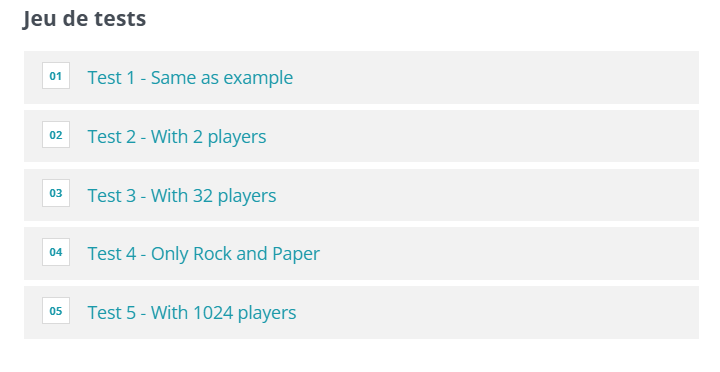

## Problème

Un tournoi international de **Pierre-Papier-Ciseaux-Lézard-Spock** est organisé. Chaque joueur reçoit un numéro lors de son inscription et choisit un signe qu'il conservera pendant tout le tournoi.  
Les règles pour déterminer le gagnant d’un duel sont les suivantes :  
- Scissors coupe Paper  
- Paper couvre Rock  
- Rock écrase Lizard  
- Lizard empoisonne Spock  
- Spock écrase Scissors  
- Scissors décapite Lizard  
- Lizard mange Paper  
- Paper réfute Spock  
- Spock vaporise Rock  
- Rock écrase Scissors  
- En cas d'égalité (même signe), le joueur avec le numéro le plus bas gagne.

Le tournoi fonctionne sous un format éliminatoire où les joueurs s'affrontent deux par deux. Le vainqueur avance au tour suivant jusqu’à ce qu’un gagnant soit désigné.

### Entrée
- Un entier `N` représentant le nombre de participants au tournoi (valeur de la forme `2^k`).
- `N` lignes décrivant chaque joueur avec un numéro `NUMPLAYER` et le signe `SIGNPLAYER` choisi parmi :  
  `R` (Rock), `P` (Paper), `C` (Scissors), `L` (Lizard), `S` (Spock).

### Sortie
- Le numéro du gagnant.
- La liste des adversaires affrontés par le gagnant, séparés par des espaces.

## Exemple d'exécution

### Entrée
```
8
4 R
1 P
8 P
3 R
7 C
5 S
6 L
2 L
```

### Sortie
```
2
6 5 1
```

### Explication
- Le joueur 2 a affronté et battu les joueurs 6, 5, et 1 dans cet ordre pour gagner le tournoi.

## Code Python

```python
import sys
import math

n = int(input())
tournament = []
for i in range(n):
    inputs = input().split()
    numplayer = int(inputs[0])
    signplayer = inputs[1]
    tournament.append((numplayer,signplayer))

def determine_winner(N, players):
    # Dictionnaire des règles du jeu
    rules = {
        'R': {'C': 'R', 'L': 'R', 'S': 'S', 'P': 'P', 'R': 'min'},
        'P': {'R': 'P', 'S': 'S', 'C': 'P', 'L': 'L', 'P': 'min'},
        'C': {'P': 'C', 'L': 'C', 'R': 'R', 'S': 'S', 'C': 'min'},
        'L': {'P': 'L', 'S': 'L', 'R': 'R', 'C': 'C', 'L': 'min'},
        'S': {'R': 'S', 'C': 'S', 'P': 'P', 'L': 'L', 'S': 'min'},
    }
    
    # Fonction pour déterminer le gagnant d'un duel
    def duel(player1, player2):
        num1, sign1 = player1
        num2, sign2 = player2
        if rules[sign1][sign2] == 'min':
            return player1 if num1 < num2 else player2
        return player1 if rules[sign1][sign2] == sign1 else player2

    opponents = {p[0]: [] for p in players}  # Suivi des adversaires

    # Organiser le tournoi
    while len(players) > 1:
        next_round = []
        for i in range(0, len(players), 2):
            winner = duel(players[i], players[i + 1])
            loser = players[i] if winner == players[i + 1] else players[i + 1]
            opponents[winner[0]].append(loser[0])
            next_round.append(winner)
        players = next_round

    # Récupérer le gagnant et ses adversaires
    winner = players[0][0]
    return winner, opponents[winner]


# Write an answer using print
# To debug: print("Debug messages...", file=sys.stderr, flush=True)
winner, opponents = determine_winner(n, tournament)
print(winner)
print(" ".join(map(str, opponents)))
```

## Explication du Code

1. **Règles du jeu** : Les règles sont codées dans un dictionnaire où chaque signe pointe vers les signes qu'il bat. En cas d'égalité (`'min'`), le numéro le plus bas l'emporte.
2. **Duel** : Une fonction `duel` compare deux joueurs et retourne le gagnant selon les règles.
3. **Suivi des adversaires** : Un dictionnaire `opponents` est utilisé pour enregistrer tous les adversaires que chaque joueur a affrontés.
4. **Tournoi** : Les joueurs sont confrontés deux par deux jusqu’à ce qu’un seul reste. À chaque étape, le perdant est ajouté à la liste des adversaires du gagnant.
5. **Résultat final** : Le gagnant final et la liste de ses adversaires sont affichés.

## Tests
